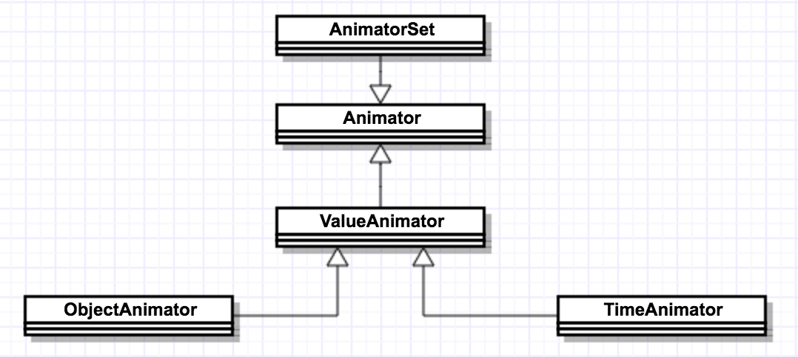

# 属性动画(Animator)

## 1、说明

### 1.1 类图

### 1.2 总体概述

主要使用用于更改对象的属性用以实现相应的动画。在API11中引入，如果使用低版本的属性动画请使用[NineOldAndroids](https://github.com/JakeWharton/NineOldAndroids);

### 1.3 属性动画和补间动画

1. Tween动画只能施加到View视图对象，而Property动画可以施加到任何对象上。现在暂未理解哪些非视图对象需要动画，时间？。
2. Tween动画只能绘制动画效果，但是View的属性并未改变。而且tween在对View的其他一些改变上也比较弱，只有在移动，旋转，显隐，缩放等功能。
3. Tween动画实现代码简单方便，但是不全。

### 1.4 动画流程

|顺序|类|输入|输出|描述|
|---|---|---|---|---|
|1|system|||系统每10ms调用一次下面的方法|
|2|animationFrame()|当前时间|时间进度|根据当前计算时间进行的百分比|
|3|animationValue(float fraction)|时间进度|位置进度|根据时间进度计算位置进度|
|4|差值器|位置进度|位置进度进行差值变化|进行差值变化|
|5|calculateValue()|变化位置进度|位置计算|计算相应的位置,PropertyValuesHolder中的方法|
|6|TypeEvaluator.evaluate|||评估当前当前的值，将百分比值估算成相应的位置。它在KeyFrame中|

说明：关于2和3，Animator在启动之后第一次调用的是setCurrentPlayTime->setCurrentFraction->animateValue()。

## 2、Animator

## 2.1 简介

所有动画的基类，里面包含属性动画的一些共用方法。

## 2.2 方法

|Java方法|XML|说明|
|---|---|---|
|setDuration(long duration)|android:duration|动画时长|
|setInterpolator(TimeInterpolator v)|android:interpolator|插补器、差值器|
|setStartDelay(long startDelay)|android:startOffset|动画延迟时间|
|setTarget(Object target)||执行动画的对象|

## 2.3 XML中动画

所有的属性动画都放置在res/animator中。

XML中的动画只能是AnimatorSet和ObjectAnimator.

代码参考如下：[动画XML](#xml)

## 3、ValueAnimator

### 3.1 属性

|Java方法|XML|说明|
|---|---|---|
|setRepeatMode(int value)|android:repeatMode|重复模式|
|setRepeatCount(int value)|android:repeatCount|重复次数|
|ofArgb(int... values) ||Argb数据，主要用于颜色变化|
|ofInt(int... values)||int类型数据变化，主要是int值变化|
|ofFloat(float... values)||float类型数据变化，主要是float值变化|
||android:valueFrom|开始值|
||android:valueTo|目标值|
||android:valueType|值类型，intType和floatType。colorType不要执行|
|setFrameDelay(long frameDelay)||多少时间刷新一次|

### 3.2 实现方法

参考：[ValueAnimatorFragment](fragment/ValueAnimatorFragment.java)

### 3.3 监听器AnimatorUpdateListener

必须配合监听器使用，监听器传回相应的变化后的值。

## 4、ObjectAnimator

### 4.1 属性

|Java方法|XML|说明|
|---|---|---|
|setPropertyName(String propertyName)|android:propertyName|String类型，必须要设置节点的属性|

属性动画最最重要的就是这个方法

所有可以设置的属性有：x,y,rotation,rotationY,scaleX,scaleY,alpha,translationX,translationY

### 4.2 Java代码

参考：[AnimatorFragment](fragment/AnimatorFragment.java)

### 4.3 Crash

Android 7.0Crash 测试手机MotoZ，莫名其妙的原因。

        ObjectAnimator objectAnimator = ObjectAnimator.ofFloat(btnStartJava, "rotationY", 0.0f, 360F);
        objectAnimator.setDuration(3000);
        objectAnimator.start();

## 5、AnimationSet

### 5.1 属性
|Java方法|XML|说明|
|---|---|---|
|playSequentially()/playTogether|android:ordering|子动画是先后有序的还是同时进行，Java方法中参数非定长参或者List<Animator>集合|

### 5.2 Java代码

参考：[AnimatorFragment](fragment/AnimatorFragment.java)

## 6、PropertyValuesHolder：属性值集合

对某一属性进行关键帧变化。

无论变化执行方法是什么，主要是将值转换问相应的关键帧。

代码参考：[PKFragment](fragment/PKFragment.java)

## 6、KeyFrame：关键帧

关键帧，设置动画的关键帧。

fraction：动画进行的百分比。0-1之间取值。

主要是设置在关键百分比时，动画应该执行的位置。已经后续执行中使用到的插补器。

代码参考：[PKFragment](fragment/PKFragment.java)

注意：

调用PropertyValuesHolder.ofKeyFrame的方式会出现下面的错误提示。

在AndroidStudio会出现错误提示"The setter for this property does not match the expected signature"

忽略该提示即可， 使用反射方式导致的提示，不影响正常编译。

## 7、自定义动画

主要是通过自定义Evaluator来实现自定义动画。

主要通过AnimatorUpdateListener和TypeEvaluator来实现动画。

参考：[高级实现](http://wiki.jikexueyuan.com/project/android-animation/5.html)

## 8、Property动画扩展

### 8.1 ViewPropertyAnimator

在API12中添加，对View进行自身的View动画

主要有两类方法 "propertyName" 和 "propertyNameBy"，propertyName指的是属性值。

前者置顶位移相应位置，后者置顶在现有基础上位移相应位置。

### 8.2 LayoutAnimator

这个动画是在API11之后添加的，但是存在较多问题。

具体参考：[LayoutTranstion](http://wiki.jikexueyuan.com/project/android-animation/12.html)

## 9、动画XML 

api<21

    <set xmlns:android="http://schemas.android.com/apk/res/android"
        android:ordering="sequentially">//执行方式，顺序执行
        <set android:ordering="together">//执行方式，一起执行
            <objectAnimator
                android:duration="1000"
                android:propertyName="y"//属性名称
                android:valueFrom="0"//开始值
                android:valueTo="200" />//结束值
            <objectAnimator
                android:duration="1000"
                android:propertyName="x"
                android:valueFrom="0"
                android:valueTo="200" />
        </set>
        <objectAnimator
                android:duration="1000"
                android:propertyName="alpha"
                android:repeatCount="2"//重复次数，可以设为infinite，无限次重复
                android:repeatMode="reverse"//重复模式
                android:valueFrom="1.0f"
                android:valueTo="0.2" />
    </set>

在API>21时可以使用更多的属性值.

    <set xmlns:android="http://schemas.android.com/apk/res/android"
        android:ordering="sequentially">
        <set android:ordering="together">
            <objectAnimator
                android:duration="3000"
                android:pathData="M 0,0 L 1,1 L 2,2 L 0.5,0.5"//需配合propertyXName、propertyYName、propertyName使用
                android:propertyXName="scaleY" //需配合pathData使用
                android:propertyYName="scaleX"/>//需配合pathData使用
        </set>
        <set android:ordering="together">
            <objectAnimator android:duration="1000">
                <propertyValuesHolder   //在5.0中引入可以用于设置ObjectAnimator
                    android:propertyName="x"
                    android:valueFrom="0"
                    android:valueTo="200" />
            </objectAnimator>
        </set>
    </set>

### 9.1 说明

关于pathData可以参考[VectorDrawable](http://www.jianshu.com/p/a3cb1e23c2c4)

关于propertyXName目前只验证了在根据PathData数据X点变化而变化
关于propertyYName目前只验证了在根据PathData数据Y点变化而变化

### 9.1 加载XML

        AnimatorSet animatorSet = (AnimatorSet) AnimatorInflater.loadAnimator(mActivity, Build.VERSION.SDK_INT >= 21 ? R.animator.animator_21 : R.animator.animator);//主要用于演示21+的差异
        animatorSet.setTarget(ivLogo);
        animatorSet.start();