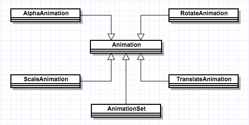

# TweenAnimation（补间动画）

## 1、Animation

### 1.1类图

### 1.2Animation属性

|xml属性|Java方法|说明|
|---|---|---|
|android:detachWallpaper|setDetachWallpaper(boolean)|设置是否在壁纸上运行|
|android:duration|setDuration(long)|设置持续时间，毫秒为单位|
|android:fillAfter|setFillAfter(boolean)|动画结束时是否保持在动画最后状态|
|android:fillBefore|setFillBefore(boolean)|动画结束时是否还原到初始状态|
|android:fillEnabled|setFillEnable(boolean)|与fillBefore效果相同|
|android:interpolator|setInterpolator(Interpolator)|设定差值器|
|android:repeatCount|setRepeatCount(int)|设置重复次数|
|android:repeatMode|setRepeatMode(int)|重复类型：reverse(翻转)/restart(从头)|
|android:startOffset|setStartOffset(long)|设置延时时间，start多长时间以后开始执行动画|
|android:zAdjustment|setZAdjustment(int)|动画的Z轴位置top/bottom/normal|

动画执行完成后，默认停止在初始位置

fillAfter和fillBefore冲突时，fillAfter起作用

fillAfter和fillEnabled冲突时，fillAfter起作用

fillBefore和fillEnabled冲突时，true起作用

fillAfter = false，无效，执行默认操作

fillBefore = false，无效，执行默认操作

fillEnable = false，无效，执行默认操作

### 1.3Animation设置

1. XML文件：在res/anim文件夹下创建相应的资源文件
2. Java类：使用创建对象的方式创建动画

### 1.4Animation的分类

1. [AlphaAnimation](#alpha)：渐变，透明动画
2. [RotateAnimation](#rotate)：旋转动画
3. [ScaleAnimation](#scale)：缩放动画
4. [TranslateAnimation](#translate)：位移动画
5. [AnimationSet](#set)：动画集合

## 2、AlphaAnimation：透明动画

## 2.1动画属性

|xml属性|Java方法|说明|
|---|---|---|
|android:fromAlpha|AlphaAnimation(float fromAlpha,float toAlpha)|构造函数中第一个参数，0.0表示全透明,1.0表示不透明|
|android:toAlpha|AlphaAnimation(float fromAlpha,float toAlpha)|构造函数中第二个参数|

## 3、RotateAnimation：旋转动画

## 3.1动画属性

|xml属性|Java方法|说明|
|---|---|---|
|android:fromDegree|RotateAnimation(float fromDegree,***)|构造函数中一个参数，开始角度|
|android:toDegree|RotateAnimation(***, float toDegree,***)|构造函数中一个参数，目标角度|
|android:pivotX|RotateAnimation(****,float pivotX,***)|构造函数中一个参数，X轴相对位置|
|android:pivotY|RotateAnimation(***, float pivotY,***)|构造函数中一个参数，Y轴相对位置与上一个参数构成一个相对点|
||RotateAnimation(****,float pivotXType,***)|构造函数中一个参数，旋转类型|
||RotateAnimation(***, float pivotYType,***)|构造函数中一个参数，旋转类型|

## 3.2动画构造方法

|构造方法|说明|
|---|---|
|RotateAnimation(float fromDegree,float toDegree)|参数1：旋转开始角度，参数2：旋转结束角度|
|RotateAnimation(float fromDegree, float toDegree, float pivotX ,float pivotY)|参数1：同上，参数2：同上，参数3：旋转中心点X坐标，参数4：旋转中心点Y坐标|
|RotateAnimation(float fromDegree,float toDegree,float pivotXType,float pivotX,float pivotYType,float pivotY)|参数1：同上，参数2：同上，参数3：X轴旋转相对位置，参数4：同上，参数5：Y轴旋转相对位置，参数6：同上|

## 3.3参数说明

属性说明：

pivotX：该参数在XML中有三种情况，分别是num，num%，num%p，分别对应位置点，相对自身位置，相对父布局位置，X轴（相对）位置与下一个参数构成一个相对点。在构造方法中根据pivotXType不同，旋转位置不同。

pivotY：该参数在XML中有三种情况，分别是num，num%，num%p，分别对应位置点，相对自身位置，相对父布局位置，Y轴（相对)位置与上一个参数构成一个相对点。在构造方法中根据pivotYType不同，旋转位置不同。

pivotXType：该参数只在构造方法中有三种情况，

       RotateAnimation.ABSOLUTE：相对位置，如果pivotX为0，表示布局的左边界，其他值表示X轴相应的坐标
       RotateAnimation.RELATIVE_TO_SELF：相对自身位置，此时pivotX的值一般是0.0-1.0之间，大于1表示在View相应宽度的相应倍数位置转动
       RotateAnimation.RELATIVE_TO_PARENT：相对父布局位置，此时PivotX的值一般是0.0-1.0之间。大于1表示View相应高度的相应倍数位置转动。

pivotYType：该参数在XML中有三种情况，分别是num，num%，num%p，分别对应位置点，相对自身位置，相对父布局位置

       RotateAnimation.ABSOLUTE：相对位置，如果pivotX为0，表示布局的左边界，其他值表示X轴相应的坐标
       RotateAnimation.RELATIVE_TO_SELF：相对自身位置，此时pivotX的值一般是0.0-1.0之间，大于1表示在View相应宽度的相应倍数位置转动
       RotateAnimation.RELATIVE_TO_PARENT：相对父布局位置，此时PivotX的值一般是0.0-1.0之间。大于1表示View相应高度的相应倍数位置转动。

## 3.2Bug讲解

## 3.2.1 Same animation more than one view;

    Animation mAnimation = AnimationUtils.loadAnimation(mActivity, R.anim.tween_animation_rotate);
    ivLogo.startAnimation(mAnimation);
    btnStartXML.startAnimation(mAnimation);

   这种情况下，动画的旋转中心点会变化。必然有一个或多个View的动画不准确，解决方式是多个View使用多个对象。

## 4、ScaleAnimation：缩放动画

## 4.1动画属性

|xml属性|Java方法|说明|
|---|---|---|
|android:fromDegree|RotateAnimation(float fromDegree,***)|构造函数中一个参数，开始角度|
|android:toDegree|RotateAnimation(***, float toDegree,***)|构造函数中一个参数，目标角度|
|android:pivotX|RotateAnimation(****,float pivotX,***)|构造函数中一个参数，X轴相对位置|
|android:pivotY|RotateAnimation(***, float pivotY,***)|构造函数中一个参数，Y轴相对位置与上一个参数构成一个相对点|
||RotateAnimation(****,float pivotXType,***)|构造函数中一个参数，旋转类型|
||RotateAnimation(***, float pivotYType,***)|构造函数中一个参数，旋转类型|

## 5、TranslateAnimation：位移动画

## 5.1动画基本属性

|xml属性|Java方法|说明|
|---|---|---|
|android:fromXDelta|TranslateAnimation(float fromXDelta,***)|构造函数中一个参数，位移开始点的X坐标|
|android:toXDelta|TranslateAnimation(***, float toXDelta,***)|构造函数中一个参数，位移结束点的X坐标|
|android:fromYDelta|TranslateAnimation(****,float fromYDelta,***)|构造函数中一个参数，位移开始点的X坐标|
|android:fromYDelta|TranslateAnimation(***, float toYDelta)|构造函数中一个参数，位移结束点的Y坐标|

动画总体是从(fromXDelta,fromYDelta)位移的(toXDelta,toYDelta);

## 5.2动画构造方法

|构造方法|说明|
|---|---|
|TranslateAnimation(float fromXDelta,float toXDelta,float fromYDelta,float toYDelta)|参数1：位移开始点X坐标，参数2：位移结束点X坐标，参数3：位移开始点Y坐标，参数4位移结束点Y坐标|
|TranslateAnimation(int fromXType,float fromXDelta,int toXType, float toXDelta,int fromYType,float fromYDelta, int toYType ,float toYDelta)|参数1：位移开始点X的类型，参数2：同上，参数3：位移结束点X坐标，参数4：同上，参数5：位移开始点Y的类型，参数6：同上，参数7：位移结束点Y坐标，参数8：同上|

开始点类型和结束点类型总共有三种。

       RotateAnimation.ABSOLUTE：相对位置，如果pivotX为0，表示布局的左边界，其他值表示X轴相应的坐标
       RotateAnimation.RELATIVE_TO_SELF：相对自身位置，此时参数的值一般是0.0-1.0之间。如果大于1表示移动位移超出控件本身
       RotateAnimation.RELATIVE_TO_PARENT：相对父布局位置，此时参数的值一般是0.0-1.0之间。。如果大于1表示移动位移超出父控件本身

## 6、AnimationSet：动画集合

## 6.1动画属性

|构造方法|说明|
|---|---|
|AnimationSet(boolean shareInterpolator)|是否共享插补器|

动画集合中的动画如果不设置offset默认是同时执行的。

## 7、自定义动画

### 7.1 自定义动画步骤

1. 创建类集成android.view.animation.Animation
2. 复写父类方法initialize，在该方法中进行子类数据的初始化。
3. 复写父类方法applyTransformation，在该方法中进行矩阵变化。

### 7.2 矩阵变化说明

在矩阵变换中使用到类：android.graphics.Camera，因为在该类中存在相应的简单的矩阵变换。

        mCamera.save();//保存原状态
        mCamera.rotateX();//绕X轴旋转
        mCamera.rotateY();//绕Y轴旋转
        mCamera.rotateZ();//绕Z轴旋转
        mCamera.getMatrix(matrix);//将矩阵放入
        mCamera.restore();//回复原状态
        matrix.preTranslate(-mPivotX, -mPivotY);//矩阵变化前
        matrix.postTranslate(mPivotX, mPivotY);//矩阵变换后

## 8、差值器、插补器

差值器又叫插补器，主要是修改线性时间内动画完成的百分比。

### 8.1 Android提供的差值器介绍

|Java类|XML(@android:anim/)|说明|
|---|---|---|
|AccelerateDecelerateInterpolator|accelerate_decelerate_interpolator|加速减速插补器，先慢后快再慢|
|AccelerateInterpolator|accelerate_interpolator|加速插补器，先慢后快|
|AnticipateInterpolator|anticipate_interpolator|向前插补器（先往回跑一点，再加速向前跑）|
|AnticipateOvershootInterpolator|anticipate_overshoot_interpolator|向前向后插补器（先往回跑一点，跑过目标后，再向后跑一点，再回到终点）|
|BounceInterpolator|bounce_interpolator|反弹插补器（在动画结束的时候回弹几下，如果是竖直向下运动的话，就是玻璃球下掉弹几下的效果）|
|CycleInterpolator|cycle_interpolator|循环插补器，循环执行相应的参数，先执行到目标点，然后反向到达目标点对应位置|
|DecelerateInterpolator|decelerate_interpolator|减速插补器|
|LinearInterpolator|linear_interpolator|直线插补器|
|OvershootInterpolator|overshoot_interpolator|超出插补器|
|FastOutLinearInInterpolator|accelerate_interpolator|MaterialDesign基于贝塞尔曲线的插补器 效果：依次 慢慢快|
|FastOutSlowInInterpolator|accelerate_interpolator|MaterialDesign基于贝塞尔曲线的插补器 效果：依次 慢慢快|
|LinearOutSlowInInterpolator|accelerate_interpolator|MaterialDesign基于贝塞尔曲线的插补器 效果：依次 慢慢快|

